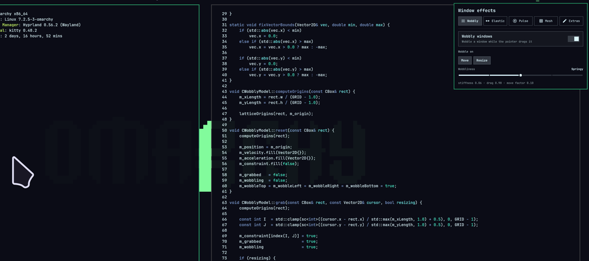
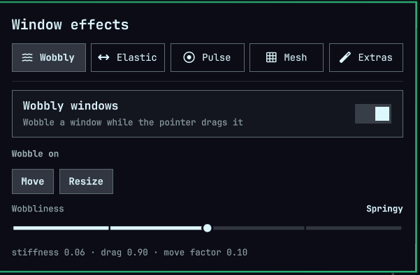

# omarchy-fx

Window effects for [Omarchy](https://omarchy.org/), as a Hyprland compositor
plugin. Three of them so far, all built on the same deformable mesh:

- **Wobbly windows** — grab a window with `SUPER` + a mouse button and it
  deforms like a sheet of jelly while it follows the cursor, then springs back
  into shape when you let go. The KDE effect, ported.
  - `SUPER` + **left** mouse drag — move, wobbling from wherever you grabbed it
  - `SUPER` + **right** mouse drag — resize, wobbling from the grabbed corner
- **Elastic moves** — when the *layout* moves a window rather than the pointer,
  the window stretches like rubber as it travels and springs back when it
  arrives. Swapping two tiled windows is the obvious case; so is the reflow
  when a window opens or closes, and a keyboard resize.
- **Focus pulse** — the window that just became active swells out a few
  pixels and settles back, so your eye finds where focus went. On by default
  for keyboard and click focus changes, off for focus that merely follows the
  mouse.

And one extra that is not a window effect: **shake to find the cursor** —
shake the pointer and it grows until you stop, as in KDE Plasma.



*Caught mid-swap: the right window's edge still bowing from the elastic move, the cursor three times its size after a shake, and the panel that drives it all.*

## Why the effects are a Hyprland plugin, not an Omarchy shell plugin

Omarchy shell plugins (`~/.config/omarchy/plugins/`) are Quickshell/QML and draw
into the bar and overlays. They can't touch how the compositor rasterises a
window, and these effects *are* a change to how the window is rasterised: the
window texture has to be resampled through a deformed mesh every frame. That
only exists inside Hyprland's render pass, so the effects ship as a Hyprland
plugin (`.so`), loaded from the Omarchy Hyprland config.

The *settings* are a different matter, and those do ship as a shell plugin — a
bar widget with a panel behind it, at the root of this repo so that
`omarchy plugin add` can install it. The two halves meet at one
`key=value` file, `~/.config/omarchy/omarchy-fx.conf`: the panel writes it and
runs a stock `hyprctl reload`, and the compositor plugin re-reads it whenever
the config reloads. Keys absent from that file fall through to the Hyprland
config, so configuring in Lua and configuring from the bar both keep working.

> The panel deliberately registers **no** custom hyprctl command. An earlier
> version did, and registering a dispatcher inside `pluginInit` crashed
> Hyprland — which, at startup, means the session never comes up and the fix
> has to be made from a TTY. Everything the panel does uses stock `hyprctl`.

## Requirements

- Hyprland with development headers (`pkg-config --exists hyprland`)
- A C++23 compiler and `make`

Hyprland's plugin ABI is not stable: **the plugin must be rebuilt after every
Hyprland update.** This is not a cosmetic requirement. A stale `.so` faults
inside `pluginInit`, and because the Hyprland config loads plugins during
compositor startup, that fault takes the session down *before* you can log in —
leaving a TTY as the only way back. `install.sh` sets up a pacman hook so the
rebuild happens for you; see [Staying in step with Hyprland](#staying-in-step-with-hyprland).

## Install

The easy way, on Omarchy:

```bash
omarchy plugin add https://github.com/stoneynutcase/omarchy-fx --enable
```

That puts the **Window Effects** widget on the bar. Click it: the panel offers
to **build and install the plugin**, which is the compositor half. It takes
about a minute and asks for your password once, for the pacman hook that
rebuilds the plugin after every Hyprland update. When it is done the effects
are live. After `omarchy plugin update omarchy-fx` the panel notices the
compositor plugin is older than the widget and offers the rebuild again.

The same, by hand, from a clone anywhere:

```bash
./install.sh
```

That builds `omarchy-fx.so`, installs it to
`~/.local/share/hyprland/plugins/`, drops `~/.config/hypr/omarchy_fx.lua`, and
appends `require("hypr.omarchy_fx")` to `~/.config/hypr/hyprland.lua` (keeping a
timestamped backup of anything it touches).

On an Omarchy shell it also installs the bar widget to
`~/.config/omarchy/plugins/omarchy-fx/` and enables it on the right of the bar
— unless that directory *is* the clone, as it is after `omarchy plugin add`, in
which case there is nothing to copy. Re-running the installer leaves the
placement alone, so `omarchy bar move omarchy-fx` sticks. Click the widget for
the settings panel, middle-click it to turn every effect off and on.



> Upgrading from the version that had only the wobble: the widget used to be
> `omarchy-fx.wobbly`, one widget per effect. The installer disables and removes
> that one and enables `omarchy-fx` in its place, so you get one widget with a
> section per effect — but it lands on the right of the bar, wherever the old
> one sat. Settings carry over; the panel reads the old key spellings.

Then load it into the running session:

```bash
hyprctl plugin load ~/.local/share/hyprland/plugins/omarchy-fx.so
```

Hyprland asks for permission the first time a plugin is loaded. The installed
config also declares `hl.permission({ ..., type = "plugin", mode = "allow" })`
so later launches don't prompt.

## What it touches

Everything this plugin writes, runs or reads outside its own checkout, so the
scope can be checked rather than trusted.

**Network:** none. Nothing here opens a socket. There is no telemetry, no
update check, no download; the build uses only the headers and libraries
already on the machine.

**Written as you, by `install.sh`:**

| Path | What |
| --- | --- |
| `~/.local/share/hyprland/plugins/omarchy-fx.so` | the compositor plugin, staged under a random name and renamed into place |
| `~/.config/hypr/omarchy_fx.lua` | the config fragment, with a random-named backup of any previous one beside it |
| `~/.config/hypr/hyprland.lua` | one `require` line appended, with a backup beside it; refused if the file is not yours |
| `~/.config/omarchy/plugins/omarchy-fx/` | the bar widget, unless that directory *is* this checkout |
| `~/.config/omarchy/shell.json` | via `omarchy plugin enable`, on first install only |

**Written as you, by the panel:** `~/.config/omarchy/omarchy-fx.conf`, the
settings file, through Quickshell's atomic write. The "build and install"
button runs `install.sh` and logs to `$XDG_RUNTIME_DIR/omarchy-fx-install.log`.

**Written as root, by `install.sh` with your consent** (a sudo or polkit
prompt; skip it with `--no-hook`):

| Path | What |
| --- | --- |
| `/etc/pacman.d/hooks/95-omarchy-fx-rebuild.hook` | the trigger, copied verbatim from `pacman/` |
| `/usr/local/bin/omarchy-fx-rebuild` | the runner, generated from `pacman/omarchy-fx-rebuild.in` with four paths filled in |

The runner is the only code that ever runs as root, on every Hyprland update.
Root does three things in it: checks that the checkout exists, drops to your
user with `runuser` and an environment built from scratch, and reports. The
build, the install of the `.so` and the disarming of a stale one all run as
you. The four paths baked in are shell-quoted with `printf %q`, so a path with
a quote or a `$` in it is a string, never code.

**Environment and tools:** the scripts set `PATH` to the system directories
and drop loader and shell variables rather than inherit them, and the runner
starts the user side from an empty environment. The panel starts every
process with a cleared environment and passes only what `hyprctl` and a
build need, and names its tools by absolute path.

**Read:** the compositor plugin reads `~/.config/omarchy/omarchy-fx.conf`
and `~/.config/omarchy/shell.json`, and the cursor theme for shake-to-find.
It writes nothing.

`uninstall.sh` removes everything in the tables above, asking for root once
for the two hook files. It edits `hyprland.lua` in place through a symlink
if it is one, so a dotfile setup survives, and only if the file is yours.

## Turning it off, and removing it

On an Omarchy shell, **the bar widget is the switch**. Middle-click it to turn
every effect off and on; the panel behind it turns each effect off separately.
Taking the widget off the bar also stops the effects:

```bash
omarchy plugin disable omarchy-fx    # or: omarchy plugin remove omarchy-fx
```

Omarchy has no way for a shell plugin to tell the compositor anything when it
is disabled, so the compositor plugin watches the shell's bar layout instead:
with the shell installed and `omarchy-fx` not on the bar, nothing deforms. That
takes effect within half a second, needs no reload, and holds across reboots.
Without an Omarchy shell the Hyprland config alone decides.

Either way the Hyprland plugin is still installed and still loads at startup —
inert, but there. The only thing that removes the `.so`, the config snippet,
the settings file and the pacman rebuild hook is:

```bash
./uninstall.sh
```

It unloads the plugin from the running compositor first, so no reboot is
needed for that either.

## Staying in step with Hyprland

`install.sh` installs a pacman hook, which needs root for two root-owned paths.
On a terminal that is a `sudo` prompt; run without one (from a launcher, a GUI,
an agent) it falls back to `pkexec`, so the password dialog comes from Omarchy's
polkit agent instead. `uninstall.sh` does the same to remove them.

| | |
| --- | --- |
| `/etc/pacman.d/hooks/95-omarchy-fx-rebuild.hook` | the trigger |
| `/usr/local/bin/omarchy-fx-rebuild` | the runner, generated with your paths baked in |

After any package that moves the plugin ABI, the hook rebuilds this checkout and
reinstalls the `.so`. It triggers on `hyprland` **and** on `aquamarine`,
`hyprcursor`, `hyprgraphics`, `hyprlang` and `hyprutils`: the version compiled
into a plugin is the Hyprland commit hash plus the versions of all five
libraries, so any of them can invalidate a built `.so`.

Two things the runner is careful about, both of which matter more than the
effects themselves:

- **It never fails the pacman transaction.** A broken build warns; it does not
  leave your system mid-upgrade.
- **If the rebuild fails, it disarms the plugin** by renaming the `.so` to
  `.so.stale`. A plugin that cannot load is a minor annoyance; a plugin that
  faults during compositor startup costs you the login.

Skip the hook with `./install.sh --no-hook` — then rebuilding after each
Hyprland update is back to being your job. `uninstall.sh` removes both files.

### Can this lock me out of my session?

It is the right question to ask of anything the compositor loads at startup,
so here is every route, and what stands in the way of each.

- **A stale build after a Hyprland update.** Hyprland's own loader compares
  only a coarse API version string, which rarely changes, so it would let a
  stale `.so` in. This plugin therefore checks the full ABI hash itself, first
  thing, and refuses to load on a mismatch with a notification. Before that
  point the pacman hook has normally rebuilt it already, and if the rebuild
  failed the hook renamed the `.so` to `.stale` so there is nothing to load.
- **A missing `.so`**, after a failed rebuild or a half-done uninstall: the
  config's `hl.plugin.load` reports an error and Hyprland carries on.
- **A bug in this plugin that crashes within seconds of loading.** That is the
  one route the checks above do not cover, and it would repeat at every login.
  So the plugin keeps a marker file, `~/.local/state/omarchy-fx/loading`,
  from the moment it loads until it has rendered for ten seconds, and removes
  it on a clean unload. Finding the marker at startup means the last session
  ended right after loading; the plugin then skips that session, says so in a
  notification, and clears the marker so the next login tries again. A real
  crash loop becomes every other login working, with the reason on screen,
  rather than no login at all. A hard reset within ten seconds of logging in
  gets the same one-session skip, which is the price of the guard.
- **A crash later in a session**, from a bug in an effect: that is a crash of
  the compositor, as with any plugin, and it is not repeated at login unless
  it happens within those first ten seconds. Please report it with the
  backtrace.

If you ever do need to get the plugin out of the way from a TTY, it is one
line: remove `require("hypr.omarchy_fx")` from `~/.config/hypr/hyprland.lua`.

Relatedly, the installer never writes the `.so` in place. It installs to a
temporary name and `rename(2)`s it over the old one, because a running Hyprland
has the previous build mapped, and truncating that file underneath the
compositor is itself a way to crash it.

## Configuration

All options live under `plugin.omarchy_fx` and are set from
`~/.config/hypr/omarchy_fx.lua`.

### Wobbly windows

| Option | Default | Meaning |
| --- | --- | --- |
| `wobbly_enabled` | `true` | Master switch |
| `wobbly_on_move` | `true` | Wobble while drag-moving |
| `wobbly_on_resize` | `true` | Wobble while drag-resizing |
| `wobbly_wobbliness` | `1` | KWin's Wobbliness slider: `0` = least, `4` = most |
| `wobbly_tessellation` | `20` | Render mesh quads per axis (2–64) |
| `wobbly_stiffness` | `-1` | Override the preset's spring stiffness; `-1` inherits |
| `wobbly_drag` | `-1` | Override the preset's drag; `-1` inherits |
| `wobbly_move_factor` | `-1` | Override the preset's move factor; `-1` inherits |

The five presets are KWin's, verbatim:

| `wobbly_wobbliness` | | stiffness | drag | move factor |
| --- | --- | --- | --- | --- |
| 0 | Rigid | 0.15 | 0.80 | 0.10 |
| 1 | Subtle | 0.10 | 0.85 | 0.10 |
| 2 | Springy | 0.06 | 0.90 | 0.10 |
| 3 | Loose | 0.03 | 0.92 | 0.20 |
| 4 | Jelly | 0.01 | 0.97 | 0.25 |

### Elastic moves

| Option | Default | Meaning |
| --- | --- | --- |
| `elastic_enabled` | `true` | Master switch |
| `elastic_on_tiled` | `true` | React when the layout animates a tiled window |
| `elastic_on_floating` | `false` | React when something animates a floating window |
| `elastic_on_workspace` | `true` | Stretch a window you carry to another workspace and follow |
| `elastic_stretchiness` | `2` | Preset: `0` = taut, `4` = taffy |
| `elastic_tessellation` | `20` | Render mesh quads per axis (2–64) |
| `elastic_period` | `-1` | Override the spring period in ms; `-1` inherits |
| `elastic_damping` | `-1` | Override the damping ratio; `-1` inherits |
| `elastic_tilt` | `-1` | Override the leading/trailing stiffness split; `-1` inherits |
| `elastic_follow` | `-1` | Override how much the window trails as a whole; `-1` inherits |
| `elastic_max_stretch` | `-1` | Override the furthest a point may be dragged, in px; `-1` inherits |

| `elastic_stretchiness` | | period | damping | tilt | follow | max stretch |
| --- | --- | --- | --- | --- | --- | --- |
| 0 | Taut | 110 ms | 0.80 | 0.35 | 0.30 | 30 px |
| 1 | Springy | 145 ms | 0.65 | 0.50 | 0.42 | 45 px |
| 2 | Elastic | 180 ms | 0.55 | 0.65 | 0.55 | 65 px |
| 3 | Rubber | 235 ms | 0.45 | 0.78 | 0.68 | 90 px |
| 4 | Taffy | 310 ms | 0.35 | 0.88 | 0.80 | 130 px |

### Focus pulse

| Option | Default | Meaning |
| --- | --- | --- |
| `pulse_enabled` | `true` | Master switch |
| `pulse_on_switch` | `true` | Pulse when focus moves by keyboard, by a dispatcher, or on its own (a window closed, a workspace changed) |
| `pulse_on_click` | `true` | Pulse when a click gives a window focus |
| `pulse_on_hover` | `false` | Pulse when focus follows the mouse. Off because with `follow_mouse` every tile you cross would swell |
| `pulse_strength` | `2` | Preset: `0` = subtle, `4` = bouncy |
| `pulse_tessellation` | `20` | Render mesh quads per axis (2–64) |
| `pulse_amount` | `-1` | Override how far the edges swell at the peak, in px; `-1` inherits |
| `pulse_period` | `-1` | Override the swell period in ms; `-1` inherits |
| `pulse_damping` | `-1` | Override the damping ratio; `-1` inherits |

| `pulse_strength` | | amount | period | damping |
| --- | --- | --- | --- | --- |
| 0 | Subtle | 4 px | 180 ms | 0.90 |
| 1 | Soft | 6 px | 220 ms | 0.70 |
| 2 | Firm | 9 px | 260 ms | 0.55 |
| 3 | Lively | 13 px | 300 ms | 0.42 |
| 4 | Bouncy | 18 px | 340 ms | 0.32 |

A window that fills its monitor never pulses; there is nowhere for it to swell
to. Neither does one that is still playing its open animation.

The file guards the `hl.config` call with `hl.get_config`, because plugin
options don't exist during the config pass that loads the plugin. Hyprland
reloads the config immediately afterwards, and that pass applies them.

### Extras

| Option | Default | Meaning |
| --- | --- | --- |
| `shake_enabled` | `true` | Shake the pointer and the cursor grows until you stop, so you can find it. KDE Plasma's "Shake Cursor" |

A port of KWin's `shakecursor`, numbers and all. The detector keeps the last
second of motion as a list of reversals and scores the trail's length against
the diagonal of the box it fits in; a sweep scores about one, a shake well
above four. The first shake takes the cursor to three times its size, every
further one adds another size on top with no ceiling, each step tweened over
200 ms, and it comes back two seconds after you stop. Motion with a button
held, or during a window drag, is never a shake. None of that is tunable.

While magnified the cursor is drawn in software, since a hardware cursor
plane has a size cap. How sharp it stays depends on the theme. With a
[hyprcursor](https://github.com/hyprwm/hyprcursor) theme, which is SVG, the
current shape is re-rendered at the exact magnified size, as KWin does with
Plasma's SVG cursors, and it is sharp at any size. With a plain Xcursor theme
the largest raster it ships is scaled, and the growth stops a little past
that size rather than balloon into a blur: Omarchy's default, Adwaita, stops
at 96 px, so about three times a 24 px cursor. To get the unbounded, sharp
version, install an SVG hyprcursor theme (`rose-pine-hyprcursor` is one) and
name it in `~/.config/hypr/envs.lua` with
`hl.env("HYPRCURSOR_THEME", "<name>")`.

## How it works

Both effects deform the same thing: a **4×4 lattice of control points** laid
over the window frame, which the renderer reads as the control net of a bicubic
Bézier surface. Only the physics differs, so a new effect is a new model, not a
new renderer.

### The wobble

A port of KWin's `wobblywindows`, close enough that the parameters mean the same
thing and the presets produce the same feel.

Points are held together only by springs to their neighbours — nothing pulls a
point towards where the window says it should be. The single exception is the
*constrained* point, the one nearest where the cursor grabbed, which is pulled
towards its own rest position and drags the whole net along behind it. That one
anchor is also what lets the lattice find its way back onto the window rect
after you let go, so it is deliberately never released.

After computing accelerations, the acceleration field and then the velocity
field are each run through a 3×3 mean filter (KWin's `heightRingLinearMean`,
where the centre carries as much weight as all its neighbours together). This
is the part that matters visually: without it the motion stays bunched up around
the grabbed point, and with it the wobble spreads across the whole window.

Integration is `velocity = acceleration·dt + velocity·drag` and
`position += velocity·dt·moveFactor`, in fixed 10 ms steps.

During a resize, an edge stays rigid until it has actually been dragged away
from where the resize started — so `SUPER`+right-drag stretches from the corner
you grabbed rather than sloshing the whole window.

### The elasticity

A different mechanism, and original rather than a port. Every lattice point is a
damped spring anchored to *its own* rest position, with no coupling to its
neighbours at all. Nothing is grabbed; the deformation is pure inertia. When
Hyprland animates the window rect out from under the lattice the points cannot
follow instantly, so they trail; when the rect stops they overshoot and ring
themselves flat. The spring is stated as a period and a damping ratio, because
those are the two things you actually want to dial: how fast it snaps back, and
how much it rings.

Carrying a window to another workspace is the one case this cannot see by
watching geometry: a workspace does not move its windows to slide, it animates
one render offset that every window on it is drawn through, so the window's own
rect never moves. That case is picked up from the `moveToWorkspace` event
instead, and the lattice then works in the offset space the window is really
drawn in.

A lattice of identical springs would only ever lag as a rigid block — every
point lags equally, and the window merely trails without changing shape. The
stretch comes from **tilting the stiffness along the direction of travel**: the
leading edge is anchored hard and keeps up, the trailing edge is anchored softly
and drags behind, so the window is pulled longer while it moves. The tilt fades
out with the window's speed, so a lattice at rest is anchored evenly and settles
back onto the rect. A resize needs no tilt to deform — there the rest positions
themselves move by different amounts, and the lattice stretches on its own.

Two things keep it honest:

- **It saturates.** Hyprland covers most of a swap in the first frame of the
  animation, far faster than a spring soft enough to be worth watching can
  follow, so the deformation would otherwise be whatever the animation curve
  happened to do. Instead the spring stiffens as a point approaches
  `elastic_max_stretch` and stops dead at it — the stretch is a design
  parameter, not an accident of the animation speed. Bounding the stiffness is
  also what keeps the fixed-step integration stable; an unbounded progressive
  spring blows up within a handful of frames.
- **`elastic_follow` splits trailing from stretching.** The physics produces
  both a bulk lag (the whole window behind its rect) and a differential (the
  window longer than its rect). `follow` scales how much of the bulk lag is
  drawn, so you can have a window that stretches without swimming away from its
  own tile. It changes what is drawn, never how the springs behave.

The trigger is deliberately dumb: any window whose position or size animation is
running gets an entry, whatever started it. That is why a swap, a reflow after a
window closes and a keyboard resize all deform without three separate hooks.
Windows currently being dragged are left to the wobble — one effect per window,
and the drag wins.

### Rendering

The renderer treats the 4×4 lattice as the control net of a **bicubic Bézier
surface**, tessellated `*_tessellation` quads per axis. Warping a coarse
interpolating grid directly would put a visible crease at every cell boundary;
the surface between control points is a cubic instead, so the deformation is
smooth. A uniform control net reproduces the rectangle exactly, which keeps an
undeformed window pixel-exact.

The lattice is defined over the window *frame*, while the mesh covers the full
bounding box. Shadows and borders therefore fall outside `[0, 1]` and the Bézier
extrapolates there, so they ride along with the window instead of diluting the
deformation.

Rendering uses Hyprland's window-transformer hook. When a transformer is
attached, Hyprland renders the window into an offscreen buffer and hands it
over; `CMeshTransformer` draws that texture back through the deformed mesh into
a second buffer and returns it. Positions and texture coordinates are normalised
in the same framebuffer space, so an undeformed mesh is a pixel-exact copy — and
when the net is flat the transformer hands the buffer straight back rather than
paying for the copy at all. The plugin detaches itself entirely once a window has
settled.

Damage is expanded to the control net's bounds each frame, plus a margin that
scales with how far the lattice has been pushed — the mesh extrapolates past the
net for shadows and borders, so a fixed margin leaves trails under a heavy
deformation. That damage is both what lets a deformation draw outside the
window's rectangle and what keeps frames scheduled while a simulation runs.

## Layout

```
src/Mesh.hpp             the 4x4 control lattice every effect deforms
src/WobblyModel.*        KWin's wobble physics, no rendering, no Hyprland state
src/ElasticModel.*       the inertial rubber-band physics, same
src/PulseModel.*         the focus swell: one damped oscillator for the whole net
src/ShakeCursor.*        shake-to-find for the cursor; nothing to do with the mesh
src/MeshTransformer.*    IWindowTransformer + the Bezier mesh GL draw
src/EffectManager.*      triggers, per-frame stepping, damage, config
src/main.cpp             plugin entry points
hypr/omarchy_fx.lua      the config fragment install.sh drops into ~/.config/hypr
manifest.json            the Omarchy shell plugin: the bar widget and its
BarWidget.qml, Panel.qml settings panel, at the root for `omarchy plugin add`
```

## Credits

The wobble physics is a port of KWin's
[`wobblywindows`](https://github.com/KDE/kwin/tree/master/src/plugins/wobblywindows)
effect by Cédric Borgese, GPL-2.0-or-later.

## Known limitations

- A plugin cannot log. `Log::logger` is an inline variable in Hyprland's
  headers, so a plugin links its own uninitialised copy of it and everything
  logged through it is silently dropped. Anything the user must be told goes
  through `HyprlandAPI::addNotification` instead.
- Blur behind a window is warped along with it (Hyprland runs the blur matte
  through the same transformer), but the blur sample itself is taken from the
  undeformed rectangle, so heavy deformation over a busy background can show a
  seam at the edge.
- A deformed window is drawn off its own rect while its input region stays put,
  so during an effect the two disagree by up to the current offset.
- Window open and close animations are left alone; they animate the geometry
  from nothing, and stretching that fights the animation rather than dressing it.
- `elastic_on_workspace` rides Hyprland's workspace slide, and Omarchy ships
  that animation disabled (`hl.animation({ leaf = "workspaces", enabled = false })`
  in its default `looknfeel.lua`). Without it a workspace switch is instant,
  there is no travel to dress, and the setting does nothing. Re-enable it in
  your own `~/.config/hypr/looknfeel.lua`, which loads after Omarchy's defaults.
- Written against the Hyprland 0.56 plugin API.

## License

GPL-2.0-or-later. The physics in `src/WobblyModel.*` is a port of KWin's
wobblywindows effect, which is GPL-2.0-or-later, so this project inherits that
licence — it cannot be MIT.
